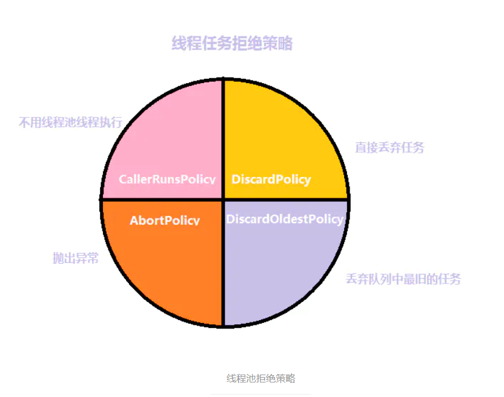

### 线程创建方式

1. 继承Thread类 

   ```java
   //step:1通过继承一个Thread类创建NewThread线程
   public class NewThread extends Thread{
   
       @Override
       public void run() {
           System.out.println("create a thread by extends Thread");
       }
   
       public static void main(String[] args) {
           //step 2：实例化一个NewThread线程对象
           NewThread newThread = new NewThread();
   
           //step 3:调用start方法启动NewThread线程
           newThread.start();
       }
   }
   ```

2. 实现Runnable接口

   ```java
   public class ChildrenClassThread implements Runnable  {
       //step1:通过实现Runnable接口方式来创建ChildrenClassThread线程
       @Override
       public void run() {
           System.out.println("create a thread by implements Runnable");
       }
   
       public static void main(String[] args) {
           //step2：实现一个ChildrenClassThread对象
           ChildrenClassThread childrenClassThread = new ChildrenClassThread();
           //step3：创建一个线程对象并将其传入已经实例化好的ChildrenThread实例
           Thread thread = new Thread(childrenClassThread);
           //step4：调用start方法启动一个线程
           thread.start();
       }
   }
   ```

3. 通过ExecutorService和Callable<Class>实现有返回值的线程

   ​	创建一个线程池、一个用于接收返回结果的Future List及Callable线程实例，使用线程池提交任务，并将线程执行之后的结果保存在Future中，在线程执行结束后遍历Future List中的Future对象，在该对象上调用get方法就可以获取Callable线程任务返回的数据并汇总结果。

   ```java
   //step1:通过实现Callable接口创建一个MyCallable线程
   public class MyCallable  implements Callable<String> {
       private String name;
       public MyCallable(String name){//通过构造函数为线程传递参数，以定义线程的名称
           this.name = name;
       }
       @Override
       public String call() throws Exception {//call方法内为线程实现的逻辑
           return name;
       }
       public static void main(String[] args) {
           //step2：创建一个固定大小为5的线程池
           ExecutorService pool = Executors.newFixedThreadPool(5);
           //step3:创建有多个返回值列表的任务列表list
          List<Future> list = new ArrayList<>();
          for (int i = 0; i < 5; i++) {
              //step4：创建一个有返回值类型的线程实例
              Callable c = new MyCallable(i + " ");
              //step5:提交线程，获取Future对象并将其保存在Future List中
              Future future = pool.submit(c);
              System.out.println("submit a callable thread:"+i);
              list.add(future);
          }
          //step6：关闭线程池，等待线程执行结束
          pool.shutdown();
          for (Future future : list){
              //step7：对象上获取任务的返回值，并将结果输出给控制台
              System.out.println("get the result from callable thread:"+future.toString());
          }
       }
   }
   ```

4. 基于线程池

```java
public class ThreadPool {
    public static void main(String[] args) {
        //step1：创建大小为10的线程池
        ExecutorService threadPool = Executors.newFixedThreadPool(10);
        for (int i = 0; i < 10; i++) {
            //Step2:提交多个线程并行执行
            threadPool.execute(new Runnable() {
                @Override
                public void run() {
                    System.out.println(Thread.currentThread().getName()+"is running");
                }
            });
        }
    }
}
```


### java线程池

#### 简述：

​	在面向软件编程中，创建和销毁对象是一件非常耗时的事情，因为创建一个对象要获取内存资源或者其它更多的资源。在Java中更是如此，虚拟机将试图跟踪每一个对象，以便能在对象销毁时进行回收。所以提供程序效率的方法就是减少对象的创建和销毁。如何利用已有的对象来服务就是一个需要解决的问题。

​	Java线程池实现了一个Java高并发的、Java多线程的、可管理的统一调度器。java.util.concurrent.Executors工作中最常用的和熟知的，顺便一提，java.util.concurrent包由出自著名的大神Doug Lea之手。

​	Executors是个线程工厂类，方便快速地创建很多线程池，也可以说是一个线程池工具类。配置一个线程池是比较复杂的，尤其是对于线程池原理不是很清楚的情况下，很可能配置的线程池不是最优的，以至于达不到预期的效果，因此Executors类里面给我们提供了一些静态工厂方法，以便我们能生成常用的线程池。
 常用的方法有如下三种：

- 1、newSingleThreadExecutor：创建一个单线程的线程池。
- 2、newFixedThreadPool：创建固定大小的线程池。
- 3、newCachedThreadPool：创建一个可缓存的线程池。

#### 1、newSingleThreadExecutor的使用

创建一个单线程的线程池。这个线程只有一个线程在工作，也就是相当于单线程串行执行所有任务。如果这个唯一的线程因为异常而结束，那么会有一个新的线程来代替它。此线程保证所有的任务的执行顺序按照任务的提交顺序执行。

```Java
public class SingleThreadExecutorDemo {
    public static void main(String[] args) {
        ExecutorService executorService=Executors.newSingleThreadExecutor();
        for (int i = 0; i < 10; i++) {
            final int no=i;
            Runnable task=new Runnable() {
                
                @Override
                public void run() {
                    try{
                        System.out.println("into "+no);
                        Thread.sleep(1000L);
                        System.out.println("end "+no);
                    }catch(InterruptedException e){
                        e.printStackTrace();
                    }
                }
            };
            //交由线程池处理任务
            executorService.execute(task);
        }
        executorService.shutdown();
        System.out.println("main thread have terminate");
    }   
}
```

查看一下Executors.newSingleThreadExecutor()的实现方法：

```java
    /**
     * Creates an Executor that uses a single worker thread operating
     * off an unbounded queue. (Note however that if this single
     * thread terminates due to a failure during execution prior to
     * shutdown, a new one will take its place if needed to execute
     * subsequent tasks.)  Tasks are guaranteed to execute
     * sequentially, and no more than one task will be active at any
     * given time. Unlike the otherwise equivalent
     * <tt>newFixedThreadPool(1)</tt> the returned executor is
     * guaranteed not to be reconfigurable to use additional threads.
     *
     * @return the newly created single-threaded Executor
     */
    public static ExecutorService newSingleThreadExecutor() {
        return new FinalizableDelegatedExecutorService
            (new ThreadPoolExecutor(1, 1,
                                    0L, TimeUnit.MILLISECONDS,
                                    new LinkedBlockingQueue<Runnable>()));
    }
```

通过源码得知，它是调用了ThreadPoolExecutor创建了一个LinkedBlockingQueue的一个大小的线程池，采用默认的异常策略。

#### 2、newCachedThreadPool的使用

创建一个缓冲池大小可根据需要伸缩的线程池，但是在以前构造的线程可用时将重用它们。对于执行很多短期异步任务而言，这些线程池通常可提供程序性能。调用execute将重用以前构造的线程（如果线程可用）。如果现有线程没有可用的，则创建一个新线程并添加到池中。终止并从缓存中移除那些已有60s未被使用的线程。因此，长时间保持空闲的线程池不会使用任何资源。
 Demo：

```Java
public class CachedThreadPoolDemo {
    public static void main(String[] args) {
        ExecutorService executorService=Executors.newCachedThreadPool();
        for (int i = 0; i < 20; i++) {
            final int no=i;
            Runnable task=new Runnable() {
                @Override
                public void run() {
                    try{
                        System.out.println("into "+no);
                        Thread.sleep(10001L);
                        System.out.println("end "+no);
                    }catch(InterruptedException e){
                        e.printStackTrace();
                    }
                }
            };
            executorService.execute(task);
        }
        System.out.println("main thread have terminate");
        executorService.shutdown();
    }
}   
```

#### 3、newFixedThreadPool的使用

创建一个可重用固定线程数的线程池，以共享的无界队列方式来运行这些线程。在任意点，在大多数nThreads线程会处于处理任务的活动状态。如果在所有线程处于活动状态时提交附加任务，则在有可用线程之前，附加任务将在队列中等待。如果在关闭前的执行期间由于失败而导致任何线程终止，那么一个新的线程将代替它执行后续任务（如果需要）。在某个线程被显示关闭之前，池中的线程将一直存在。
 Demo：

```Java
public class newFixedThreadPoolDemo {
    public static void main(String[] args) {
        ExecutorService executorService=Executors.newFixedThreadPool(5);
        for (int i = 0; i < 20; i++) {
            final int no=i;
            Runnable task=new Runnable() {
                @Override
                public void run() {
                    try{
                        System.out.println("into "+no);
                        Thread.sleep(1000L);
                        System.out.println("end "+no);
                    }catch(InterruptedException e){
                        e.printStackTrace();
                    }
                }
            };
            executorService.execute(task);
        }
        System.out.println("main thread have terminate");
        executorService.shutdown();
    }
}
```

#### 线程池的好处

1、合理利用线程能带来4个好处

(1). 降低资源消耗。通过重复利用已创建的线程，降低线程创建和销毁造成的消耗。
 (2). 提供响应速度。当任务到达时，任务可以不需要等待线程创建就能立即执行。
 (3).提供线程的可管理性。线程是稀缺资源，如果无限制的创建，不仅会消耗系统资源，还会降低系统的稳定性，使用线程池可以进行统一分配、调优和监控。但是要做到合理地利用线程，必须对其原理了如指掌。
 (4).防止服务器过载，形成内存溢出，或者CPU耗尽。

###### 2、线程池技术如何高服务器程序的性能

这里所提及的服务器程序是指能够接收客户端请求并处理请求的程序，而不只是那些接受网络客户端请求的网络服务器程序。多线程技术主要解决处理器单元内多个线程执行的问题，它可以显著减少处理器单元的闲置时间，增加处理器单元的吞吐能力。但如果对多线程应用不当，会增加对单个任务的处理时间。

#### 线程池两个核心队列

- 线程等待池，即线程队列BlockingQueue。
- 任务处理池（PoolWorker），即正在工作的Thread列表（HashSet<Worker>）。

#### 线程池的核心参数

- 核心池大小（corePoolSize），即固定大小，设定好之后，线程池的稳定峰值，达到这个值之后池的线程数大小不会释放。
- 最大处理线程池数（maximumPoolSize），当线程池里面的线程数超过corePoolSize，小于maximumPoolSize时会动态创建与回收线程池里面的线程池资源。

#### 线程池的运行机制：
 举个栗子。假如有一个工厂，工厂里面有10个人，每个工人同时只能做一件事情。因此只要当10个工人中有工人是空闲的，来了任务就分配给空闲的工人做；当10个工人都有任务时，如果还来任务，就把任务进行排队等待。
 如果说新任务数目增长的速度远远大于工作做任务的速度，那么此时工厂的主管可能就需要采取补救措施了，比如重新招4个工人进来；然后就将任务分配给这4个刚招进来的工人处理。
 如果说这14个工人做任务的速度还是不够，此时工厂主管就要考虑不再接受新的任务或者抛弃前面的一些任务了。当这14个工人当中有人空闲时，而新任务增长的速度又比较缓慢，工厂主管就要考虑辞掉4个临时工了，只保持原来10个工人，比较额外的工人是需要花费的。
 而这个栗子中永远等待干活的10个工人机制就是workerQueue。这个栗子中的corePoolSize就是10，而maximumPoolSize就是14（10+4）。也就是说corePoolSize就是线程池的大小，maximumPoolSize在我看来就是一种线程池任务超过负荷的一种补救措施，即任务量突然过大时的一种补救措施。再看看下面图好好理解一下。工人永远在等待干活，就像workerQueue永远在循环干活一样，除非，整个线程池停止了。

### 自定义线程池与ExecutorService

自定义线程池需要用到ThreadFactory，本节将通过创建一个线程的例子对ExecutorService及其参数进行详细讲解。

#### 1.认识ExecutorService家族

ExecutorService家族成员如下所示：

-1626958594491.jpg)

上图中主要元素说明如下：
 Executor：线程池的顶级接口，但是严格意义上讲Executor并不是一个线程池，而只是一个执行线程的工具。
 ExecutorService：真正线程池接口。这个接口继承了Executor接口，并声明了一些方法：
 submit、invokeAll、invokeAny以及shutDown等。
 AbstractExecutorService实现了ExecutorService接口，基本实现了ExecutorService中声明的所有方法。
 ThreadPoolExecutor：ExecutorService的默认实现，继承了类AbstractExecutorService。
 ScheduledExecutorService：与Timer/TimerTask类似，解决那些需要任务重复执行的问题。
 ScheduledThreadPoolExecutor：继承ThreadPoolExecutor的ScheduledExecutorService接口实现，周期性任务调度的类实现。
 Executors是个线程工厂类，方便我们快速地创建线程池。

#### 2.了解线程池的拒绝策略(RejectExecutionHandler)：

当调用ThreadPoolExecutor的execute方法时，而此时线程池处于一个饱和的状态，并且任务队列也已经满了那么就需要做丢弃处理，RejectExecutionHandler就是这样的一个处理接口类。
 RejectExecutionHandler.java

在JDK里面有4中拒绝策略，如下图所示：

- AbortPolicy：一言不合就抛异常（默认使用策略）。
- CallerRunsPolicy：只用调用者所在线程来运行任务。
- DiscardOldestPolicy：丢弃队列里最近的一个任务，并执行当前任务。
- DiscardPolicy：不处理，直接丢弃。

来看下源码吧：
AbortPolicy : 一言不合就抛异常的

```java
   /**
     * A handler for rejected tasks that throws a
     * {@code RejectedExecutionException}.
     */
    public static class AbortPolicy implements RejectedExecutionHandler {
        /**
         * Creates an {@code AbortPolicy}.
         */
        public AbortPolicy() { }

        /**
         * Always throws RejectedExecutionException.
         *
         * @param r the runnable task requested to be executed
         * @param e the executor attempting to execute this task
         * @throws RejectedExecutionException always.
         */
        public void rejectedExecution(Runnable r, ThreadPoolExecutor e) {
            throw new RejectedExecutionException("Task " + r.toString() +
                                                 " rejected from " +
                                                 e.toString());
        }
    }
```

CallerRunsPolicy：调用者所在线程来运行任务

```java
    /**
     * A handler for rejected tasks that runs the rejected task
     * directly in the calling thread of the {@code execute} method,
     * unless the executor has been shut down, in which case the task
     * is discarded.
     */
    public static class CallerRunsPolicy implements RejectedExecutionHandler {
        /**
         * Creates a {@code CallerRunsPolicy}.
         */
        public CallerRunsPolicy() { }

        /**
         * Executes task r in the caller's thread, unless the executor
         * has been shut down, in which case the task is discarded.
         *
         * @param r the runnable task requested to be executed
         * @param e the executor attempting to execute this task
         */
        public void rejectedExecution(Runnable r, ThreadPoolExecutor e) {
            if (!e.isShutdown()) {
                r.run();
            }
        }
    }
```

DiscardOldestPolicy :丢弃队列里面最近的一个任务,并执行当前任务

```java
    /**
     * A handler for rejected tasks that discards the oldest unhandled
     * request and then retries {@code execute}, unless the executor
     * is shut down, in which case the task is discarded.
     */
    public static class DiscardOldestPolicy implements RejectedExecutionHandler {
        /**
         * Creates a {@code DiscardOldestPolicy} for the given executor.
         */
        public DiscardOldestPolicy() { }

        /**
         * Obtains and ignores the next task that the executor
         * would otherwise execute, if one is immediately available,
         * and then retries execution of task r, unless the executor
         * is shut down, in which case task r is instead discarded.
         *
         * @param r the runnable task requested to be executed
         * @param e the executor attempting to execute this task
         */
        public void rejectedExecution(Runnable r, ThreadPoolExecutor e) {
            if (!e.isShutdown()) {
                e.getQueue().poll();
                e.execute(r);
            }
        }
    }
```

DiscardPolicy : 不处理，直接丢弃

```java
/**
     * A handler for rejected tasks that silently discards the
     * rejected task.
     */
    public static class DiscardPolicy implements RejectedExecutionHandler {
        /**
         * Creates a {@code DiscardPolicy}.
         */
        public DiscardPolicy() { }

        /**
         * Does nothing, which has the effect of discarding task r.
         *
         * @param r the runnable task requested to be executed
         * @param e the executor attempting to execute this task
         */
        public void rejectedExecution(Runnable r, ThreadPoolExecutor e) {
        }
    }
```

8/2
