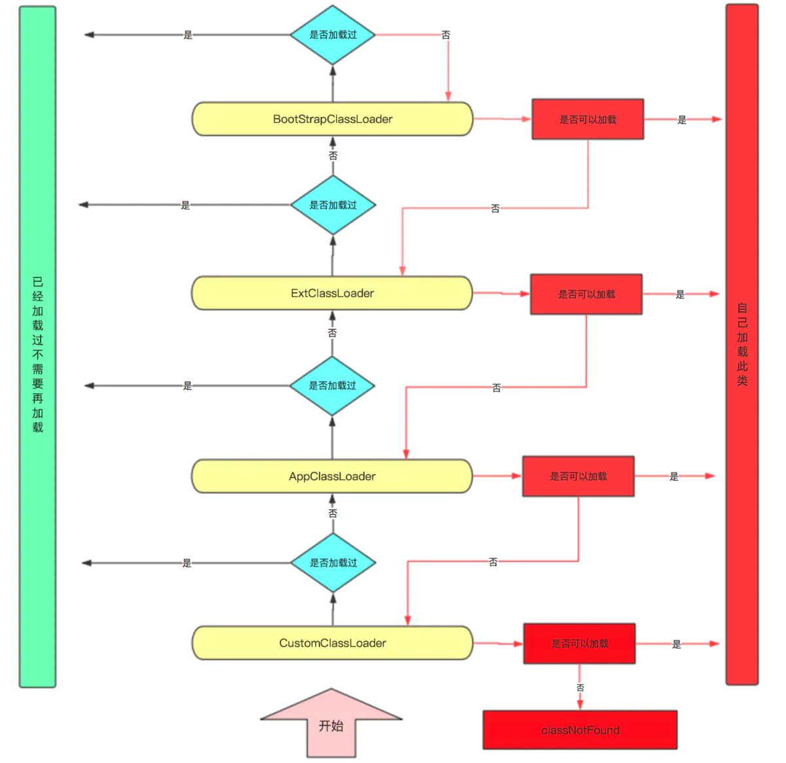

### 1、什么是GC Roots？

首先我们知道标记算法，JVM的标记算法我们可以了解为一个可达性算法，所以所有的可达性算法都会有起点，那么这个起点就是GC Root。也就是需要通过GC Root 找出所有活的对象，那么剩下所有的没有标记的对象就是需要回收的对象。


### 2、GC Roots在哪里？

- 所有Java线程当前活跃的栈帧里指向GC堆里的对象的引用；换句话说，当前所有正在被调用的方法的引用类型的参数/局部变量/临时值。

- VM的一些静态数据结构里指向GC堆里的对象的引用，例如说HotSpot VM里的Universe里有很多这样的引用。

### 3、标记清除算法

最早出现也是最基础的垃圾收集算法是标记-清除(Mark-Sweep)算法，分为“标记”和“清除”两个阶段：

- 首先标记出所有需要回收的对象
- 在标记完成后，统一回收掉所有被标记的对象
- 也可以反过来，标记存活的对象，统一回收所有未被标记的对象

标记过程就是对象是否属于垃圾的判定过程。

之所以说它是最基础的收集算法，是因为后续的收集算法大多都是以标记-清除算法为基础，对其缺点进行改进而得到的。它的主要缺点有两个：

- 执行效率不稳定，如果Java堆中包含大量对象，而且其中大部分是需要被回收的，这时必须进行大量标记和清除的动作，导致标记和清除两个过程的执行效率都随对象数量增长而降低
- 内存空间的碎片化问题，标记、清除之后会产生大量不连续的内存碎片


### 4、标记复制算法

标记复制算法具体步骤：

1. 首先，当Eden区满的时候会触发第一次GC，把还活着的对象拷贝到SurvivorFrom区，当Eden区再次触发GC的时候会扫描Eden区和From区域，对这两个区域进行垃圾回收，经过这次回收后还存活着的对象，则直接复制到To区域(如果有对象的年龄已经达到了老年的标准，则赋值到老年代区)，同时把这些对象的年龄 + 1。
2. 然后，情况Eden和SurvivoFrom中的对象，也即复制之后有交换，谁空谁是To。
3. SurvivorTo和SurvivorFrom互换。
4. 最后，SurvivoTo和SurvivorFrom互换，原SurvivorTo成为下一次GC时的SurvivorFrom区。部分对象会在From和To区域中复制来复制去，如此交换15次(由JVM参数MaxTenuringThreshold决定，这个参数默认是15)，最终如果还是存活，就存入老年代。

###  5、标记整理法

#### 标记整理法思想：

标记复制算法在对象存活率较高时就要进行较多的复制操作，效率将会降低。更关键的是，如果不想浪费50%的空间，就需要有额外的空间进行分配担保，以应对被使用的内存中所有对象都100%存活的极端情况，所以在老年代一般不能直接选用这种算法。

针对老年代对象的存亡特征，标记整理法其中的标记过程仍然与标记清除算法一样，但后续步骤不是直接对可回收对象进行清理，而是让所有存活的对象都向内存空间一端移动，然后直接清理掉边界以外的内存，如下图所示。


#### **标记整理法的优缺点**:

标记清除算法与标记整理算法的本质差异在于前者是一种非移动式的回收算法，而后者是移动式的。是否移动回收后的存活对象是一项优缺点并存的风险决策：

- 如果移动存活对象，尤其是在老年代这种每次回收都有大量对象存活区域，移动存活对象并更新所有引用这些对象的地方将会是一种极为负重的操作，而且这种对象移动操作必须全程暂停用户应用程序才能进行，这就更加让使用者不得不小心翼翼地权衡其弊端了。
- 但如果跟标记清除算法那样完全不考虑移动和整理存活对象的话，弥散于堆中的存活对象导致的空间碎片化问题就只能依赖更为复杂的内存分配器和内存访问器来解决。内存的访问是用户程序最频繁的操作，甚至都没有之一，假如在这个环节上增加了额外的负担，势必会直接影响应用程序的吞吐量。

基于以上两点，是否移动对象都存在弊端。

- 从垃圾收集的停顿时间来看，不移动对象停顿时间会更短，甚至可以不需要停顿
- 但是从整个程序的吞吐量来看，移动对象会更划算

HotSpot虚拟机里面关注吞吐量的Parallel Scavenge收集器是基于标记整理算法的，而关注延迟的CMS收集器则是基于标记清除算法的。另外还有一种“和稀泥式”解决方案，做法是让虚拟机平时多数时间都采用标记清除算法，暂时容忍内存碎片的存在，直到内存空间的碎片化程度已经大到影响对象分配时，再采用一次标记整理法，前面提到的基于标记清除法的CMS收集器面临空间碎片过多时采用的就是这种处理办法。

### 6、Java NIO使用

要实现Java NIO，就需要分别实现Server和Client。具体的Server实现代码如下：

``` java
public class MyServer {
    private int size = 1024;
    private ServerSocketChannel serverSocketChannel;
    private ByteBuffer byteBuffer;
    private Selector selector;
    private int remoteClientNum = 10;
    public MyServer(int port) {
        try {
            //在构造函数中国初始化Channel监听
            initChannel(port);
        }catch (IOException e) {
            e.printStackTrace();
            System.exit(-1);
        }
    }

    //Channel的初始化
    private void initChannel(int port) throws IOException {
        //打开Channel
        serverSocketChannel = ServerSocketChannel.open();
        //设置为非阻塞模式
        serverSocketChannel.configureBlocking(false);
        //绑定端口
        serverSocketChannel.bind(new InetSocketAddress(port));
        System.out.println("listener on port:"+port);
        //选择器得创建
        selector = Selector.open();
        //先选择器注入通道
        serverSocketChannel.register(selector, SelectionKey.OP_ACCEPT);
        //分配缓冲区的大小
        byteBuffer = ByteBuffer.allocate(size);
    }
    //监听器，用于监听Channel上的数据变化
    private void listener() throws IOException {
        while (true) {
            //返回的int值表示有多少个Channel处于就绪状态
            int n = selector.select();
            if( n == 0 ){
                continue;
            }
            //每个selector对应多个SelectionKey，每一个SelectionKey对应一个Channel
            Iterator<SelectionKey> iterator = selector.selectedKeys().iterator();
            while (iterator.hasNext()){
                SelectionKey key = iterator.next();
                //如果key处于连接就绪状态，则开始接收客服端的连接
                if(key.isAcceptable()){
                    //获取Channel
                    ServerSocketChannel server = (ServerSocketChannel) key.channel();
                    //Channel接受连接
                    SocketChannel channel = server.accept();
                    //Channel注册
                    registerChannel(selector,channel,SelectionKey.OP_READ);
                    //远端客户端连接
                    remoteClientNum++;
                    System.out.println("online client num="+ remoteClientNum);
                    write(channel,"hello clinet".getBytes());
                }
                //如果通道已经处于读就绪状态
                if(key.isReadable()){
                    read(key);
                }
                iterator.remove();
            }
        }
    }

    private void read(SelectionKey key) throws IOException {
        SocketChannel socketChannel = (SocketChannel) key.channel();
        int count;
        byteBuffer.clear();
        //从通道中读取数据到缓冲区
        while ((count = socketChannel.read(byteBuffer))>0){
            //byteBuffer写模式变成读模式
            byteBuffer.flip();
            while (byteBuffer.hasRemaining()){
                System.out.println((char)byteBuffer.get());
            }
            byteBuffer.clear();
        }
        if (count < 0) {
            socketChannel.close();
        }
    }

    private void write(SocketChannel channel, byte[] writeData) throws IOException {
        byteBuffer.clear();
        byteBuffer.put(writeData);
        //byteBuffer从写入模式变成读模式
        byteBuffer.flip();
        //从缓冲区的数据写入通道中
        channel.write(byteBuffer);

    }

    private void registerChannel(Selector selector,SocketChannel channel,int opRead)throws IOException {
        if(channel == null){
            return;
        }
        channel.configureBlocking(false);
        channel.register(selector, opRead);
    }

    public static void main(String[] args) {
        try {
            MyServer myServer = new MyServer(9999);
            myServer.listener();
        }catch (Exception e) {
            e.printStackTrace();
        }
    }
}

```

以上代码种定义了名为MyServer的服务端实现类，在该类中定义了serverSocketChannel用于serverSocketChannel的建立和端口绑定，byteChannel用于不同Channel之间的数据交互；selector用于监听服务器各个Channel上的数据的变化并作出响应，同时，在类构造函数中调用了初始化ServerSocketChannel的操作，定义了listener方法来监听Channel上的数据变化，解析客户端并对客户端的请求做出响应。

具体的Client实现代码如下：

``` java
public class MyClient {
    private int size = 1024;
    private ByteBuffer byteBuffer;
    private SocketChannel socketChannel;
    public void connectServer() throws IOException {
        socketChannel= SocketChannel.open();
        socketChannel.connect(new InetSocketAddress("127.0.0.1",9999));
        socketChannel.configureBlocking(false);
        byteBuffer = ByteBuffer.allocate(size);
        receive();

    }

    private void receive() throws IOException{
        while (true){
            byteBuffer.clear();
            int count;
            //如果没有数据，则read方法一直阻塞，直到读取到新数据
            while ((count=socketChannel.read(byteBuffer))>0){
                byteBuffer.flip();
                while (byteBuffer.hasRemaining()){
                    System.out.println((char)byteBuffer.get());
                }
                send2Server("say hi".getBytes());
                byteBuffer.clear();
            }
        }
    }

    private void send2Server(byte[] bytes)  throws IOException{
        byteBuffer.clear();
        byteBuffer.put(bytes);
        byteBuffer.flip();
        socketChannel.write(byteBuffer);
    }

    public static void main(String[] args) throws IOException{
        new MyClient().connectServer();
    }
}
```

在以上定义了MyClient类来实现客户端的Channel逻辑，其中，connectServer方法用于和服务器端建立

，receive方法用于接收服务器端发来的数据，send2Server用于向服务器发送数据。

###  7、双亲委派机制

#### 什么是双亲委派机制？

当某个类加载器需要加载某个`.class`文件时，它首先把这个任务委托给他的上级类加载器，递归这个操作，如果上级的类加载器没有加载，自己才会去加载这个类。

####  类加载器的类别

**BootstrapClassLoader(启动类加载器)**

`c++`编写，加载`java`核心库 `java.*`,构造`ExtClassLoader`和`AppClassLoader`。由于引导类加载器涉及到虚拟机本地实现细节，开发者无法直接获取到启动类加载器的引用，所以不允许直接通过引用进行操作

**ExtClassLoader(标准扩展类加载器)**

`java`编写，加载扩展库，如`classpath`中的`jre` ，`javax.*`或者
`java.ext.dir` 指定位置中的类，开发者可以直接使用标准扩展类加载器。

**AppClassLoader(系统类加载器)**

```
java`编写，加载程序所在的目录，如`user.dir`所在的位置的`class
```

**CustomClassLoader(用户自定义类加载器)**

`java`编写,用户自定义的类加载器,可加载指定路径的`class`文件

#### 委派机制流程图



#### 双亲委派机制的作用

1. 防止重复加载同一个`.class`。通过委托去向上面问一问，加载过了，就不用再加载一遍。保证数据安全。

2. 保证核心`.class`不能被篡改。通过委托方式，不会去篡改核心`.clas`，即使篡改也不会去加载，即使加载也不会是同一个`.class`对象了。不同的加载器加载同一个`.class`也不是同一个`Class`对象。这样保证了`Class`执行安全。

   
